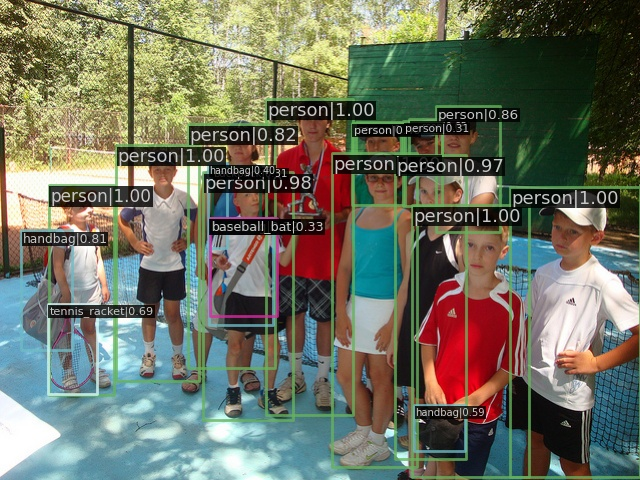
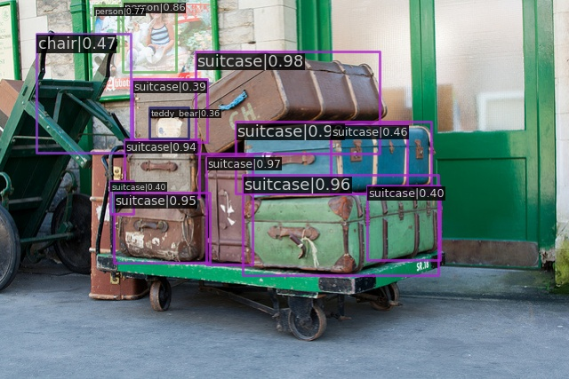

# Object-Detection

Run Faster R-CNN and Mask R-CNN based on [MMDetection](https://github.com/open-mmlab/mmdetection) v2.28.2

## OS
Linux 

## Prerequisites
1. Create a conda environment and activate it.
   ```
   conda create --name rcnn python=3.8 -y
   conda activate rcnn
   ```

2. Install PyTorch following [official instructions](https://pytorch.org/get-started/locally/), e.g.<br>
   On CUDA 11.6 platforms:
   ```
   conda install pytorch==1.13.1 torchvision==0.14.1 torchaudio==0.13.1 pytorch-cuda=11.6 -c pytorch -c nvidia
   ```
## Installation
1. Install MMCV using MIM.
   ```
   pip install -U openmim
   mim install mmcv-full
   ```
2. Install this project in dev mode.
   ```
   git clone https://github.com/jsxzs/Object-Detection.git
   cd object_detection
   pip install -v -e .
   ```

## Preparations
1. Prepare dataset.
   ```
   cd data/coco
   bash coco.sh
   cd ../..
   ```

2. Prepare checkpoint file.
   ```
   cd checkpoints
   bash modules.sh
   cd ../
   ```

## Test Faster RCNN
1. Test bbox AP and inference speed.
   ```
   bash scripts/faster_rcnn_test.sh
   ```
   bbox AP:

   

   inference speed:

   

2. Visualize.
   ```
   bash scripts/faster_rcnn_vis.sh
   ```
   
   

## Test Mask RCNN
1. Test bbox AP, segm AP and inference speed.
   ```
   bash scripts/mask_rcnn_test.sh
   ```
   bbox AP:

   

   mask AP:

   

   inference speed:
   
   

2. Visualize.
   ```
   bash scripts/mask_rcnn_vis.sh
   ```
   
   
